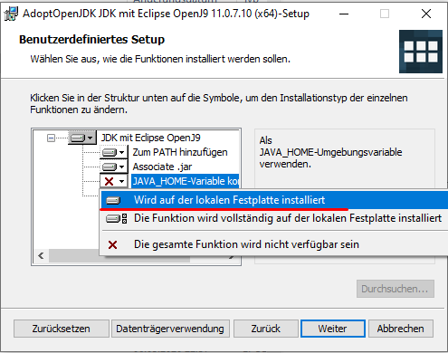
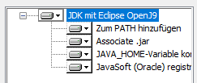
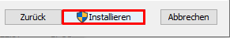
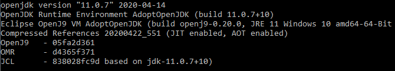

# Automatische Java Installation
- Besucht die Seite von [AdoptOpenJDK](https://adoptopenjdk.net/?variant=openjdk11&jvmVariant=openj9).
- Wählt `Java 11` und `OpenJ9` wenn nicht ausgewählt.
- Drückt auf `Neuste Veröffentlichung`. 

- Nach dem Download, öffnet ihr den Installer.
- Akzeptiert die Lizenzvereinbahrung.
- Unter `Benutzerdefiniertes Setup`, wählt ihr jedes Modul das mit einem X versehen ist und stellt es auf `Wird auf der lokalen Festplatte installiert`. 

- Es sollte dann so aussehen: 

- Drückt auf `Weiter` sowie auf `Installieren`. 

- Nachdem die Installation zu Ende ist, öffnet ihr die Eingabeaufforderung/Terminal/Konsole/Cmd ([Win+R] -> `cmd` -> Ausführen) 

- Führt `java -version` aus, wenn alles geglückt ist sollten sie die Version ihrer Installation sehen. 

- Fertig.

> Zurück: [hier](../README.md)
